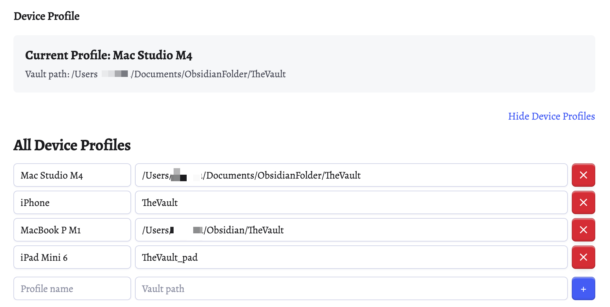

# Link Injection Redirect

Make your Obsidian links smarter with dynamic variables and flexible routing options. Perfect for multi-device vaults, URL schemes, and context-aware workflows.

## Table of Contents

- [Installation](#installation)
  - [From Obsidian Community Plugins (Coming Soon)](#from-obsidian-community-plugins-coming-soon)
  - [Using BRAT (Beta Reviewers Auto-update Tool)](#using-brat-beta-reviewers-auto-update-tool)
  - [Manual Installation](#manual-installation)
- [Getting Started](#getting-started)
  - [Do You Need Device Profiles?](#do-you-need-device-profiles)
  - [Understanding Link Types](#understanding-link-types)
- [Basic Usage](#basic-usage)
  - [Dictionary Variables](#dictionary-variables)
  - [Note Properties](#note-properties)
- [Advanced Features](#advanced-features)
  - [OR Patterns](#or-patterns)
    - [Basic OR Pattern](#basic-or-pattern)
    - [Grammar Sugar](#grammar-sugar)
    - [Nested OR Patterns](#nested-or-patterns)
    - [Cartesian Product](#cartesian-product)
  - [Managing Menu Options](#managing-menu-options)
- [Reference](#reference)
  - [Pattern Syntax](#pattern-syntax)
  - [Key Naming Rules](#key-naming-rules)
  - [Case Sensitivity](#case-sensitivity)
  - [Special Features](#special-features)
  - [Displaying Variables in Note Content](#displaying-variables-in-note-content)
  - [Mobile Support](#mobile-support)

---

## Installation

### From Obsidian Community Plugins (Coming Soon)

This plugin is currently being prepared for submission to the official Obsidian Community Plugin store.

### Using BRAT (Beta Reviewers Auto-update Tool)

If you want to install and receive updates before the plugin is available in the community store:

1. Install the [BRAT plugin](https://github.com/TfTHacker/obsidian42-brat) from the Community Plugins store
2. Open BRAT settings: Settings → BRAT → Add Beta Plugin
3. Enter this repository URL: `https://github.com/ctrl-alt-delete-8/Obsidian-Link-Injection-Redirect`
4. Click "Add Plugin"
5. Enable "Link Injection Redirect" in Settings → Community plugins

BRAT will automatically check for updates and keep your plugin current.

### Manual Installation

#### Desktop & Android

1. Download `main.js`, `manifest.json`, and `styles.css` from the [latest release](https://github.com/ctrl-alt-delete-8/Obsidian-Link-Injection-Redirect/releases)
2. Navigate to your vault folder and create the plugin directory:
   ```
   VaultFolder/.obsidian/plugins/link-injection-redirect/
   ```
3. Copy the three downloaded files into this folder
4. Reload Obsidian (Ctrl/Cmd + R) or restart the app
5. Enable the plugin: Settings → Community plugins → Link Injection Redirect → Enable

#### iOS (iPhone/iPad)

**Option 1: Automatic (If syncing .obsidian folder)**

If you're already syncing your vault's hidden folders, the plugin will automatically install when you set it up on another device.

**Option 2: Manual (No sync setup)**

iOS doesn't expose hidden folders by default, so you'll need a file manager that can access `.obsidian`:

1. Download [Textastic Code Editor](https://apps.apple.com/us/app/textastic-code-editor/id1049254261) (recommended) or another file manager that shows hidden files
2. Download the three plugin files (`main.js`, `manifest.json`, `styles.css`) to a visible folder (like Downloads or iCloud Drive)
3. Create a new folder: `link-injection-redirect`
4. Open Textastic and navigate to your vault
5. Locate the `.obsidian/plugins/` folder
6. Move the three files from your download location into this folder
7. Reload Obsidian and enable the plugin in Settings → Community plugins

---

## Getting Started

> [!TIP]
> Most users can start with just dictionary variables. Only set up device profiles if you're syncing settings across multiple devices with different local paths.

### Do You Need Device Profiles?

**If you're NOT syncing plugin settings** across devices, you can skip device profiles entirely. Just use the default dictionary settings.

**If you ARE syncing** your vault's plugin settings across multiple devices and need different values per device (like local file paths), device profiles let you override specific keys per vault path.

> [!IMPORTANT]
> If you have multiple iOS devices that need syncing, you may need to rename your vault folder on each device to make them unique (e.g., `MyVault-iPhone` vs `MyVault-iPad`). Otherwise, they'll share the same profile since iOS vault paths are typically identical.



### Understanding Link Types

The plugin handles two types of links differently:

#### External Links (http://, https://, file://)
```markdown
[Website](https://example.com/${PAGE})
[Local File](file:///${DOCUMENTS}/report.pdf)
```
**How to use:** Right-click → Choose "Open in webviewer" or "Open externally"

> [!NOTE]
> External links require right-click because the plugin can only access the link URL from the context menu event. This approach only reads link content when you interact with it, keeping your vault fast and private.

#### Internal Links ([[...]])
```markdown
[[Project ${L:project_name}]]
[[Files/${FOLDER}/document]]
```
**How to use:** Cmd/Ctrl+Click (or just click) - Opens directly

Internal links work with direct click because Obsidian provides the link text directly through its API when you click them.

---

## Basic Usage

### Dictionary Variables

Dictionary variables are perfect for **values that don't change often** across your vault.

**Common use cases:**
- Server URLs
- File paths
- API endpoints
- Your username/email

**Example: Managing Server Environments**

```markdown
**Settings:**
- DEV: http://localhost:3000
- STAGING: https://staging.myapp.com
- PROD: https://myapp.com

**In your notes:**
[API Docs](${PROD}/docs)
[Admin Panel](${STAGING}/admin)
```

**Syntax:** `${KEY}` (case-insensitive: `${dev}` = `${DEV}` = `${Dev}`)

### Note Properties

Note properties (`${L:property}`) are perfect for **values that change per-note**.

> [!TIP]
> **This Plugin vs Dataview**
>
> Use this plugin for:
> - **OR patterns**: `[[Notes/${${L:Today},,${L:Today}_backup}]]` - Multiple fallback options
> - **Simple syntax**: `${KEY}` - No JavaScript required
>
> Use [Dataview inline JavaScript](https://blacksmithgu.github.io/obsidian-dataview/reference/functions/#elink) for:
> - **Complex logic**: Full JavaScript control for single links
> - **Advanced access**: Dataview can also access plugin dictionary settings via `app.plugins.plugins['link-injection-redirect'].settings.defaultLinkReplacements['KEY']`

**Example: This Plugin (Simple Syntax)**

```yaml
---
project: Sample Project
---

GitHub: [View Issues](${GITHUB}/${L:project}/issues)
```

**Example: Dataview Equivalent (More Control)**

```yaml
---
project: Sample Project
---

`$= "[View Issues](" + app.plugins.plugins['link-injection-redirect'].settings.defaultLinkReplacements['GITHUB'] + "/" + dv.current().project + "/issues)"`
```

The dataview approach offers more control but requires inline JavaScript. The third link (OR pattern) cannot be done with Dataview.

**Example: Dynamic Documentation**

```yaml
---
library: react
version: 18.2.0
---

- [API Docs](https://${L:library}js.org/docs/${L:version}/)
- [GitHub](https://github.com/facebook/${L:library})
- [NPM](https://npmjs.com/package/${L:library})
```

Change the frontmatter → All links update automatically!

**Syntax:** `${L:property_name}` (accesses frontmatter properties)

**Note:** For internal links, invalid characters for file names (`/`, `\`, `:`) in property values are automatically replaced with spaces (configurable in settings).

---

## Advanced Features

### OR Patterns

OR patterns give you **multiple options for a single link**. Perfect when you have alternatives or fallbacks.

**Syntax:** Separate options with `,,` (double-comma)

#### Basic OR Pattern

```markdown
**Dictionary:**
- RCLONE: file:///Users/name/rclone-mount
- DOWNLOADS: Downloads

**Link:**
[[Files/${RCLONE,,DOWNLOADS}/document.pdf]]
```

**What happens:**
- Click the link → Modal appears with 2 options
- Choose "RCLONE" → Opens from mounted drive
- Choose "DOWNLOADS" → Opens from Downloads folder

#### Grammar Sugar

Simple variables auto-expand:
```markdown
${one,,two,,three}
```
Is equivalent to:
```markdown
${${one},,${two},,${three}}
```

#### Nested OR Patterns

Mix variables with text:
```markdown
${${RCLONE}/backup,,${CLOUD}/sync,,Downloads}
```

With properties:
```markdown
[[Notes/${${L:Today},,${L:Today}_backup}]]
```

> [!WARNING]
> **Colon Character Limitation**
>
> Obsidian automatically strips `:` characters when processing markdown links `[text](url)`. To use protocols like `file://` or `https://`, store them inside dictionary variables instead of writing them directly in the link.
>
> ```markdown
> ❌ [Link](file://${PATH})           // Colon will be stripped
> ✅ [Link](${FILE_PROTOCOL}${PATH})  // FILE_PROTOCOL = file://
> ```

#### Cartesian Product

Multiple OR patterns → All combinations:

```markdown
**Dictionary:**
- SERVER1: https://server1.com
- SERVER2: https://server2.com
- API: /api
- ADMIN: /admin

**Link:**
[Endpoints](${SERVER1,,SERVER2}${API,,ADMIN}/status)
```

**Result:** 4 options (2 × 2):
1. https://server1.com/api/status
2. https://server1.com/admin/status
3. https://server2.com/api/status
4. https://server2.com/admin/status

### Managing Menu Options

> [!TIP]
> By default, each variable shows two menu items (webviewer + external). Disable unused options to keep your context menu clean.

#### Setting Per-Key Preferences

1. **Open Settings** → Link Injection Redirect → "Edit Link Replacement Dictionary"
2. **Find your key row**
3. **Toggle the icons:**
   - 🌐 Globe = Webviewer option
   - 🔗 Link = External option

**Fallback:** If you set webviewer-only but webviewer is disabled, the external option appears automatically.

## Reference

### Pattern Syntax

| Pattern | Description | Example |
|---------|-------------|---------|
| `${KEY}` | Dictionary variable (case-insensitive) | `${HOSTNAME}` |
| `${L:property}` | Note frontmatter property | `${L:task_name}` |
| `${ONE,,TWO}` | Simple OR pattern (shorthand of `${${ONE},${TWO}}`) | `${DEV,,PROD}` |
| `${${KEY}sometext,,${OTHER}}` | Variable + text in OR options | `${${DRIVE}/backup,,${CLOUD}}` |

### Key Naming Rules

> [!CAUTION]
> **Not allowed in key names:**
> - `:` (reserved for `${L:property}`)
> - `,` (reserved for OR patterns)

**Allowed:** Letters, numbers, underscores (`A-Z`, `a-z`, `0-9`, `_`)

### Case Sensitivity

All dictionary lookups are **case-insensitive**:
- `${hostname}` = `${HOSTNAME}` = `${HostName}`

### Special Features

> [!NOTE]
> **dummy:// Prefix**
>
> Use `dummy://` to force Obsidian to recognize text as an external link:
> ```markdown
> [File](dummy://${something})
> ```
> The plugin automatically strips this prefix when opening.

### Displaying Variables in Note Content

Although this plugin is designed for link injection (not displaying variables in note content), you can still display variable values using [Dataview](https://github.com/blacksmithgu/obsidian-dataview) inline JavaScript.

**Important:** You must enable "Enable Inline JavaScript Queries" in Dataview settings.

**Reading note properties (frontmatter):**
```markdown
---
project: my-awesome-app
version: 1.2.3
---

Project: `$= dv.current().project`
Version: `$= dv.current().version`
```

**Reading plugin dictionary settings:**
```markdown
GitHub: `$= app.plugins.plugins['link-injection-redirect'].settings.defaultLinkReplacements['GITHUB']`
API URL: `$= app.plugins.plugins['link-injection-redirect'].settings.defaultLinkReplacements['API_URL']`
```

### Mobile Support

- Device profiles: ✅ Work on mobile
- Webviewer: ❌ Not available (only external opening)
- All other features: ✅ Work identically

