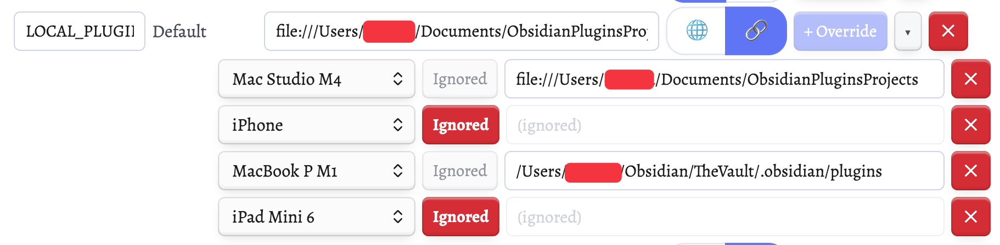
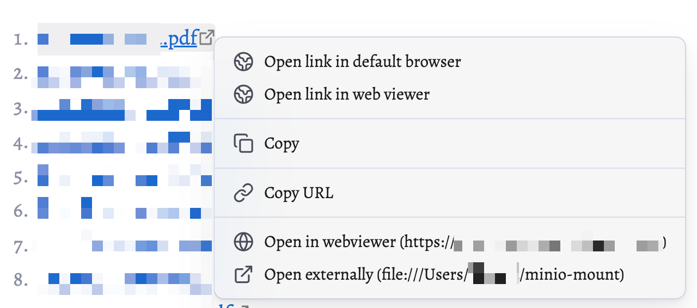
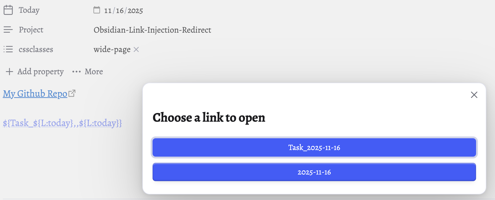
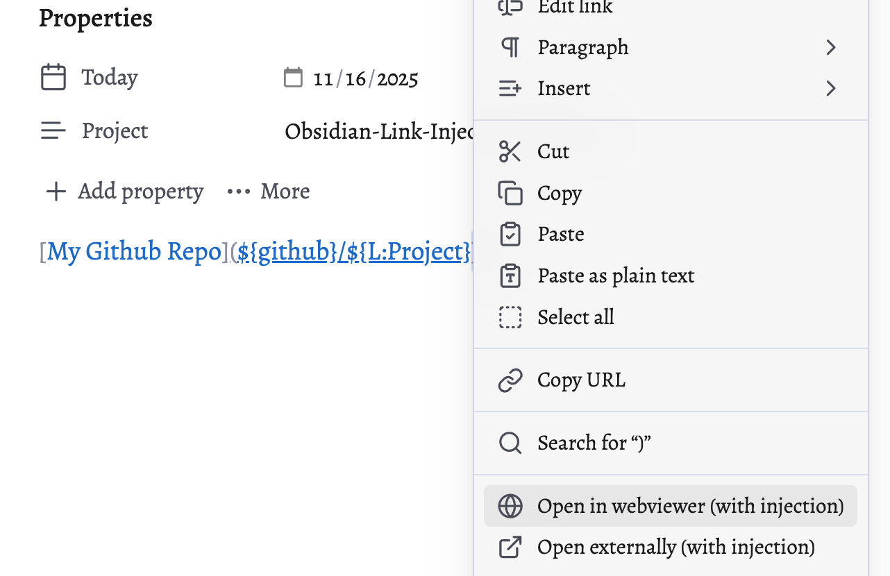

# Link Injection Redirect

Stop repeating yourself. Start linking smarter.


## The Problems

**Problem 1: Repetitive Typing**

```markdown
[Docs](https://my-super-long-domain-name.com/docs)
[API](https://my-super-long-domain-name.com/api)
[Status](https://my-super-long-domain-name.com/status)
```
Every time you type that hostname. Every. Single. Time.

**Problem 2: Device-Specific Paths**

```markdown
<!-- On laptop -->
[Project](file:///Users/name/projects/myapp)

<!-- On desktop -->
[Project](file:///Users/desktop/work/myapp)

<!-- On mobile -->
💥 Link breaks because path doesn't exist
```
Same vault, different devices, broken links everywhere.

**Problem 3: Same file Multiple Links = Horizontal Clutter**

```markdown
[My pdf webdav](https://my-webdav-server.me/test.pdf) | [My pdf Local](file:///Users/name/Documents/test.pdf)
```

Three links to the same file eating up horizontal space, especially if you like to work in live preview. Low information density. Hard to read.

## The Solutions

**Solution 1: Variables**

```markdown
<!-- Set once: DOMAIN = https://my-super-long-domain-name.com -->

[Docs](${DOMAIN}/docs)
[API](${DOMAIN}/api)
[Status](${DOMAIN}/status)
```
Type `${DOMAIN}` instead of the full URL. Change it once, updates everywhere.

**Solution 2: Device Profiles**

```markdown
<!-- One link works everywhere -->
[Project](file:///${PROJECTS}/myapp)
```

`${PROJECTS}` automatically resolves to:

- `/Users/name/projects` on laptop
- `/Users/desktop/work` on desktop
- *Ignored* on mobile (where it doesn't exist)



**Solution 3: OR Patterns (Vertical Structure)**

```markdown
<!-- One link, multiple options -->
[Single file link](dummy://${WEBDAV,,LOCAL}/test.pdf)
```
Click → Choose your option:
- `LOCAL` → Opens from local file
- `WEBDAV` → Opens the online webdav version

Two steps, vertical menu, same space. Higher information density.

It works for both external and internal links.

 



## Quick Start

1. **Install** via [BRAT](https://github.com/TfTHacker/obsidian42-brat) or [manual installation](DOCUMENTATION.md#installation)

2. **Add a variable**: Settings → Link Injection Redirect → Edit Dictionary

   ```
   Key: GITHUB
   Value: https://github.com/ctrl-alt-delete-8
   ```

3. **Go to a project file** with the local property:
   ```yaml
   ---
   project: Obsidian-Link-Injection-Redirect
   ---
   ```

4. **Use it**:
   ```markdown
   [My Plugin Repo](${GITHUB}/${L:project})
   ```
   Right-click → Open through webviewer or external browser

   

## Features

- **Dictionary Variables**: `${KEY}` - Global values that work everywhere
- **Note Properties**: `${L:property}` - Per-note values from frontmatter
- **OR Patterns**: `${one,,two,,three}` - Multiple options, choose at click time
- **Device Profiles**: Different values per device using vault path
- **Internal Links**: `[[Files/${FOLDER}/doc]]` - Works with Obsidian wikilinks
- **URL Schemes**: Perfect for `session://`, `vscode://`, custom workflows

## Other usage

**URL Scheme Automation**

I use this to quickly start a session timer together with the plugin [TaskNotes](https://github.com/callumalpass/tasknotes), (Recommended, Not affilated).

```yaml
---
title: Fix bug
timeEstimate: 30
---

[⏱️ Start Session](session:///${e}start?intent=${L:title}&duration=${L:timeEstimate})
```

## Documentation

📚 **[Full Documentation](DOCUMENTATION.md)**
- Installation (BRAT, Manual, iOS)
- Complete Tutorial
- Advanced Patterns
- Device Profiles Setup
- All Examples

## vs Dataview

**Use this plugin for:**
- OR patterns (multiple link options)
- Simple static syntax (`${KEY}`)

**Use Dataview for:**
- Fine-grained JavaScript control
- Complex single-link logic

Both can access note properties and plugin settings. This plugin is simpler. Dataview is more powerful. [See detailed comparison](DOCUMENTATION.md#note-properties).

## Support

- **Issues**: [GitHub Issues](https://github.com/ctrl-alt-delete-8/Obsidian-Link-Injection-Redirect/issues)
- **Discord**: [Join our Discord](https://discord.com/invite/bXMpCTBMcg)
- **Donate**: [Buy me a coffee](https://www.buymeacoffee.com/tinkerer.ctrl.alt.del)

## Credits

Created by [@tinkerer-ctrl-alt-del](https://github.com/ctrl-alt-delete-8) • Template by [Obsidian Sample Plugin](https://github.com/obsidianmd/obsidian-sample-plugin) • Inspired by [Variables plugin](https://github.com/jffaust/obsidian-variables)
